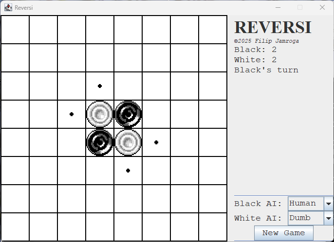

# Bare Minimum Java Reversi

This is a Reversi implementation written in pure Java without the use of any AI, IDE or even a build system like maven or ant. Instead, a combination of Notepad++ and simplistic batch scripts was used.

The game also only uses libraries from the javax.swing, java.awt and java.util packages. With this, it should be possible to compile and run on more exotic hardware like for example an iMac G3.

## Features

Believe it or not, but the game has some!

 * Working Reversi (duh)
 * Hotseat multiplayer
 * AI opponent with three different difficulty levels
 * The ability to pit two AI bots against each other

## Screenshots

*Initial game screen*

## Assets

The assets for the pieces are taken from [opengameart.org](https://opengameart.org/content/checkers).